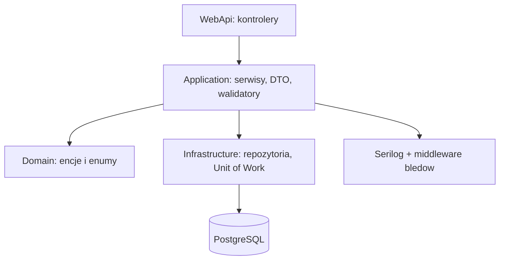

# Architektura - University Exam Scheduler

Ponizsze diagramy pokazuja widok kontekstowy systemu oraz podzial backendu na warstwy.

## 1. Diagram kontekstowy (system + integracje)
```mermaid
flowchart LR
    U[Uzytkownicy] -->|HTTPS| FE[Frontend (Vite + React)]
    FE -->|REST/JSON| API[Web API (.NET 8)]
    API -->|EF Core| DB[(PostgreSQL)]
    API -->|Swagger/OpenAPI| SWG[Swagger UI]
    API -->|metryki/traces/logi| OBS[(OTel Collector / Grafana)]
```

## 2. Diagram warstw backendu

